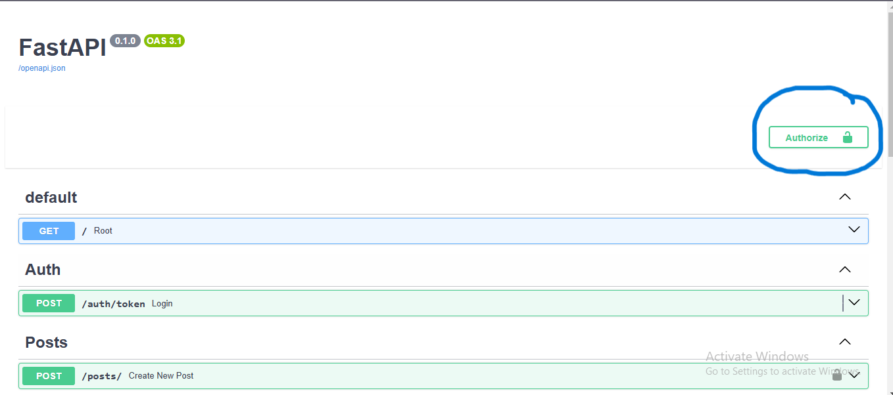
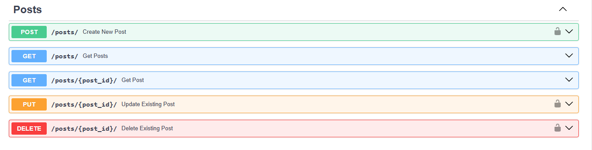
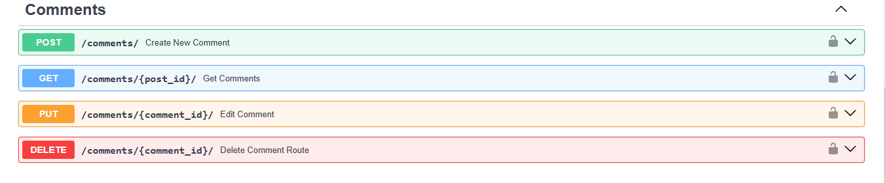

# DataCoLab Api

#### How to Run?
### 1- Clone the repository:
```bash
 $ git clone https://github.com/mmdhossein1379/DataCoLab.git
 ```
### or use SSH
```bash
 $ git clone git@github.com:mmdhossein1379/DataCoLab.git
 ```
next 
```bash
 $ cd DataCoLab
```

### 2- Create a virtualenv and activate it:
```bash
Windows:
py -3 -m venv venv
venv\Scripts\activate
```
```bash
Linux:
$ python3 -m venv venv
$ . venv/bin/activate
```
### 3- In *database.py* set up the your database:
For your convenience, the variables are inside the constants.py file

```bash
DATABASE_URL = f"postgresql://{DATABASE_USER}:{DATABASE_PASSWORD}@{DATABASE_HOST}/{DATABASE_NAME}"
```
## and
```bash
DATABASE_URL = f"postgresql://{DATABASE_USER}:{DATABASE_PASSWORD}@{DATABASE_HOST}/{DATABASE_NAME}"
```
```bash
conn = psycopg2.connect(
            dbname="postgres",
            user=DATABASE_USER,
            password=DATABASE_PASSWORD,
            host=DATABASE_HOST,
            port=DATABASE_PORT,
        )
```

### 4- Install the requirements :
```bash
pip install -r requirements.txt
```
### 5- Create secret key
```bash
 $ python secret.py
```
### and copy secret key in *.env*
```bash
SECRET_KEY= "YOUR SECRET_KEY"
```

### 6- Run the development server:
```bash
uvicorn main:app --reload
```
Open http://127.0.0.1:8000 in your browser.

### for test api 
```bash
http://127.0.0.1:8000/docs
```

#### if you like add member i handle and you run create for you admin and author and reader
```bash
python add_user.py
```

# Docker
### in first go to *constants.py*
```bash
DOCKER_MODE = True
```
#### go to *docker_compose.yml*
```bash
  db:
    image: postgres:15
    environment:
      POSTGRES_USER: "YOUR_USER"
      POSTGRES_PASSWORD: "YOUR_PASSWORD"
      POSTGRES_DB: "YOUR_NAME_DB"
    ports:
      - "5432:5432"
    volumes:
      - postgres_data:/var/lib/postgresql/data
    healthcheck:
      test: [ "CMD-SHELL", "pg_isready -U YOUR_USER" ]
      interval: 10s
      timeout: 5s
      retries: 5
```
### for build Dockerfile
```bash
docker build -t <YOUR NAME APP> . 
```
#### you use *docker-compose* for run. i suggest this way for docker
```bash
docker-compose up --build 
```

#### if you add member for test
### 1-
```bash
docker ps -a  
```
### 2-
```bash
docker exec -it <app_container_name> bash
```
### 3- create add user with this
```bash
python add_user.py 
```
# Test
### 1- go to project file
```bash
cd test
```
#### if you work with unittest
```bash
pytest unit_test.py
```
#### if you work with integration.py
```bash
pytest integration.py
```

# pictures project
## for authentication

## for use with post Api

## for use with comment Api

